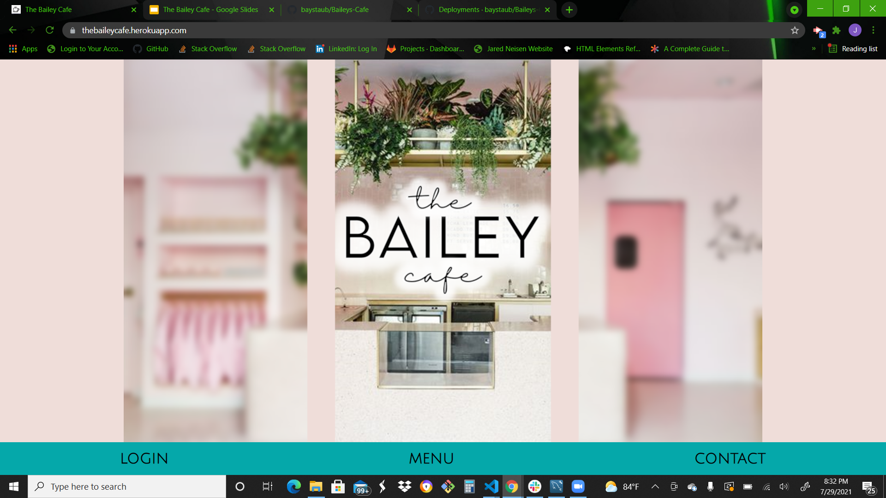
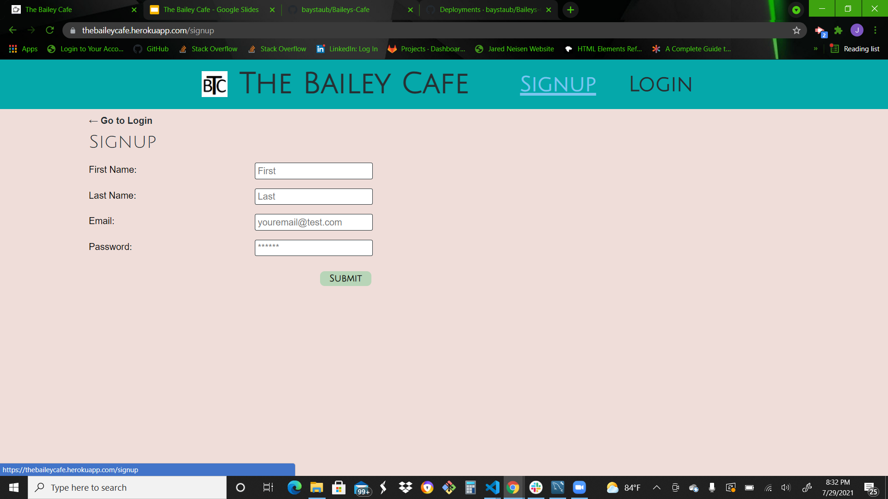
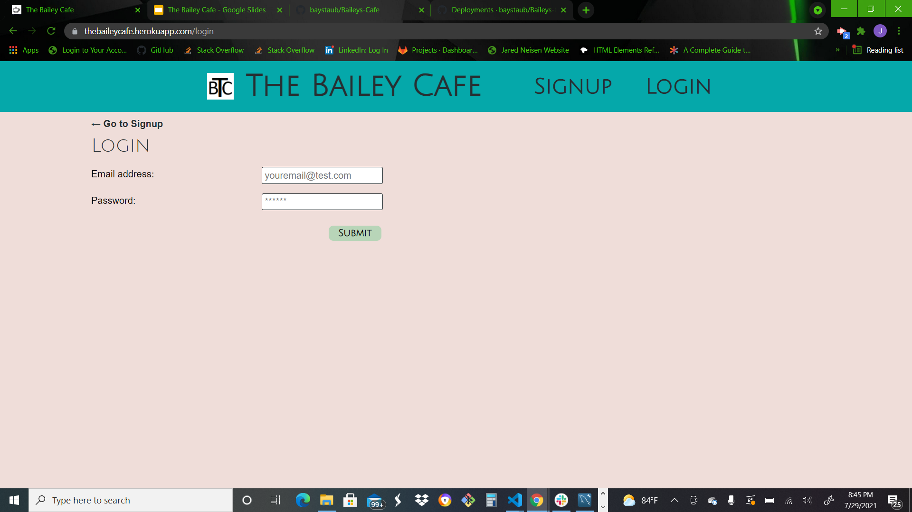
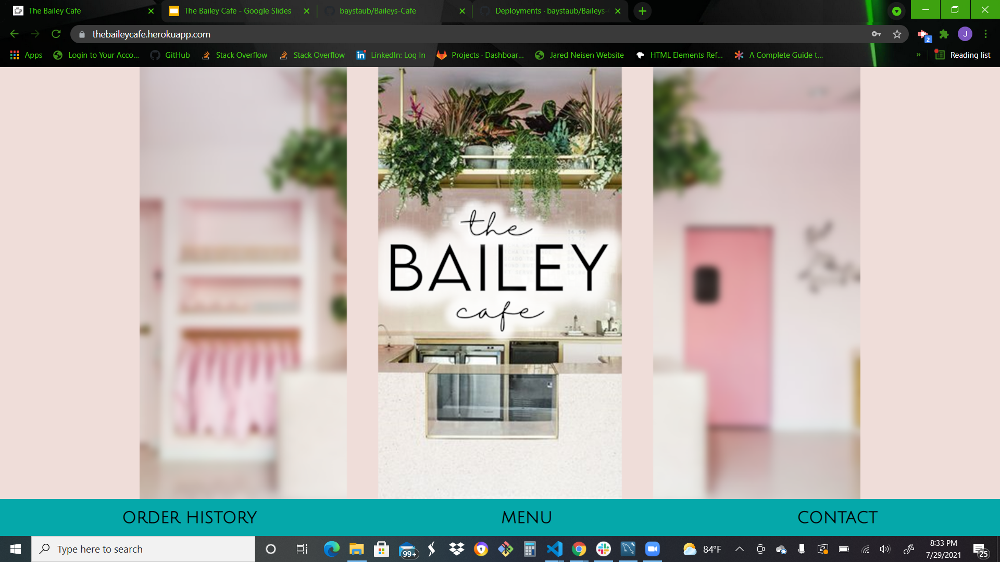
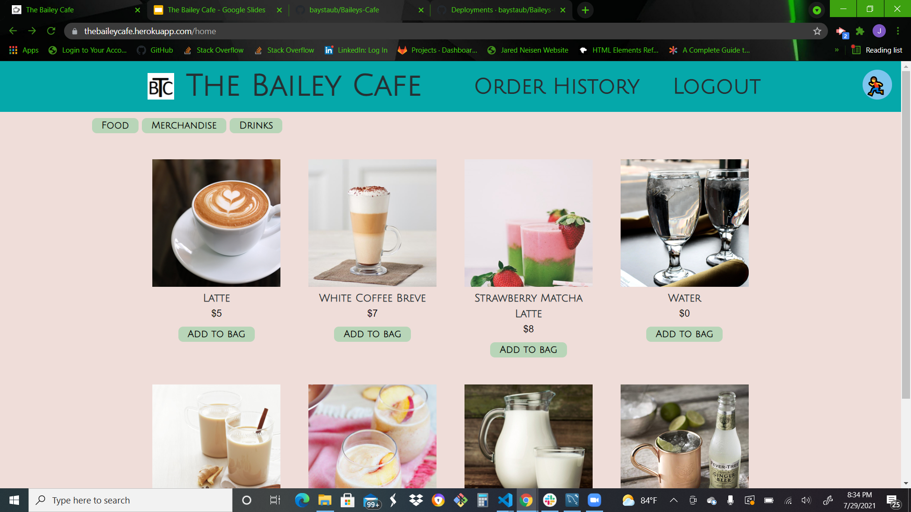
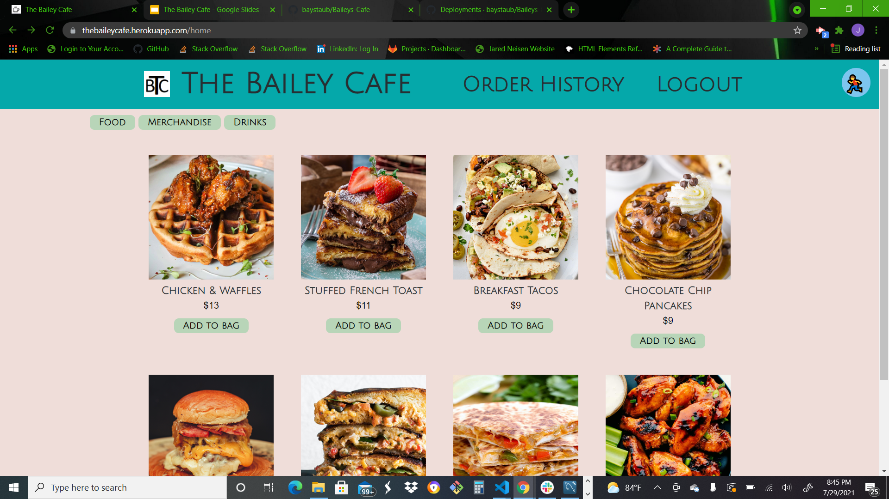
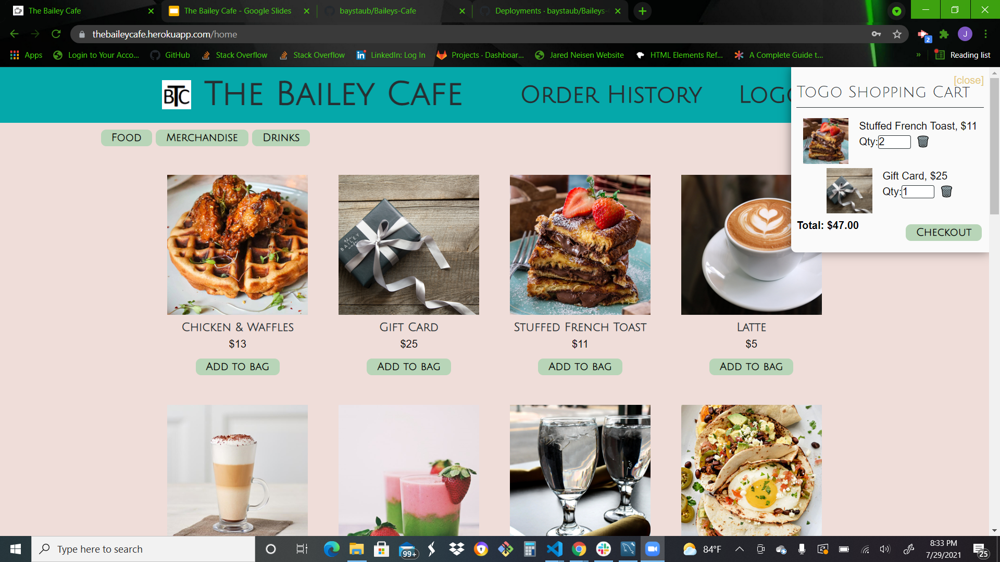
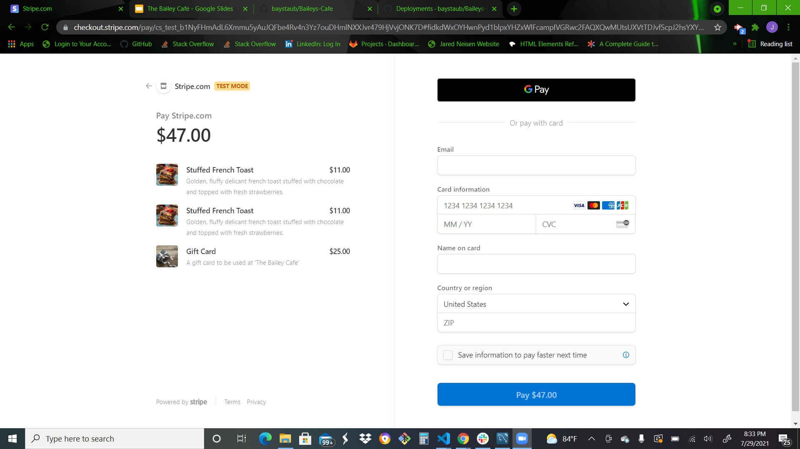

# The Bailey 
-initial opening of application

-signup/login page


-landing page once signed in

-Menu pages



-Items added to a cart

-stripe integration


## Installation

1.  Clone the repository down to your local machine.
2.  Open up VS Code or application of your choice.
3.  Run the following command:

```
npm install
```
4. Wait for the installation to fully finish.
5. Run the following command:
```
npm start
```
6. View the application on `http://localhost:3000`

## links to deployment
Heroku: https://thebaileycafe.herokuapp.com
github: https://github.com/baystaub/Baileys-Cafe


## Contributors

* Nickolas Clymer `https://github.com/ncclymer`
* Chris Garcia `https://github.com/childishmartino`
* Kelsea Hunt `https://github.com/k-ryanhunt`
* Jared Neisen `https://github.com/Jared-N2`
* Bailey Staub `https://github.com/baystaub`

## Licenses


[](https://forthebadge.com)[](https://forthebadge.com)[](https://forthebadge.com)[](https://forthebadge.com)[](https://forthebadge.com)